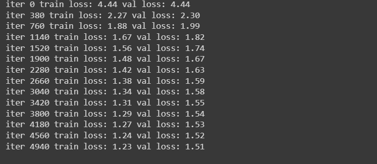

# Shakespearean Text Generation with Transformers

This project utilizes the power of Transformer-based language models to generate Shakespearean text. With the help of deep learning, it's now possible to create text that captures the essence of Shakespearean literature. The model has been trained on a dataset of Shakespearean texts and is capable of generating new text in the Bard's signature style.

## Table of Contents

- [About](#about)
- [Getting Started](#getting-started)
- [Usage](#usage)
- [Model Architecture](#model-architecture)
- [Inference](#inference)
- [Results](#results)
- [Credits](#credits)
- [License](#license)

## About

This project is inspired by the works of William Shakespeare and leverages the advancements in deep learning to generate text that mimics the style and language of the famous playwright. It's a fun and educational exploration of natural language processing and machine learning.

## Getting Started

- Clone the repo

    ```git clone https://github.com/GraphicsMonster/Shakespearean-Text-Generation-with-Transformers```

- Navigate to the project folder

    ``cd Shakespearean-Text-Generation-with-Transformers``

- Train the model

    `python model.py`

- You can tweak the hyperparameters before training as per your requirements through the model.py file. Make sure you perform the same changes in inference.py file as well in order to perform inference withot any issues.

## Model architecture
The heart of this project is the Transformer-based language model. It employs attention mechanisms, multiple heads, and deep neural networks to learn and generate text that emulates Shakespeare's writing style. The model architecture is based on the groundbreaking work of Vaswani et al. in the "Attention is All You Need" paper.

## Inference
To generate text with the trained model, simply run the inference.py script and provide a seed text. The model will produce text that follows the style of Shakespeare. Experiment with different seeds to see the model's creative abilities in action.

I've already trained the model and saved the trained parameters in the shakespeare_model.pth file so you don't have to necessarily train the model again. You can get started with inference right away.

Example usage:

`python inference.py`

## Results



The generated text will capture the essence of Shakespeare's language and style, producing fascinating and often whimsical results. Explore the generated text to uncover the hidden talents of this language model.

## Credits
This project was developed with the guidance of Andrej Karpathy's excellent tutorial on text generation. We stand on the shoulders of giants to bring you this Shakespearean text generator.

- [Andrej's Youtube tutorial](https://www.youtube.com/watch?v=kCc8FmEb1nY)

## License
This project is licensed under the MIT License - see the [LICENSE](https://github.com/git/git-scm.com/blob/main/MIT-LICENSE.txt) file for details.

Happy text generation, and may your quills be ever poetic!